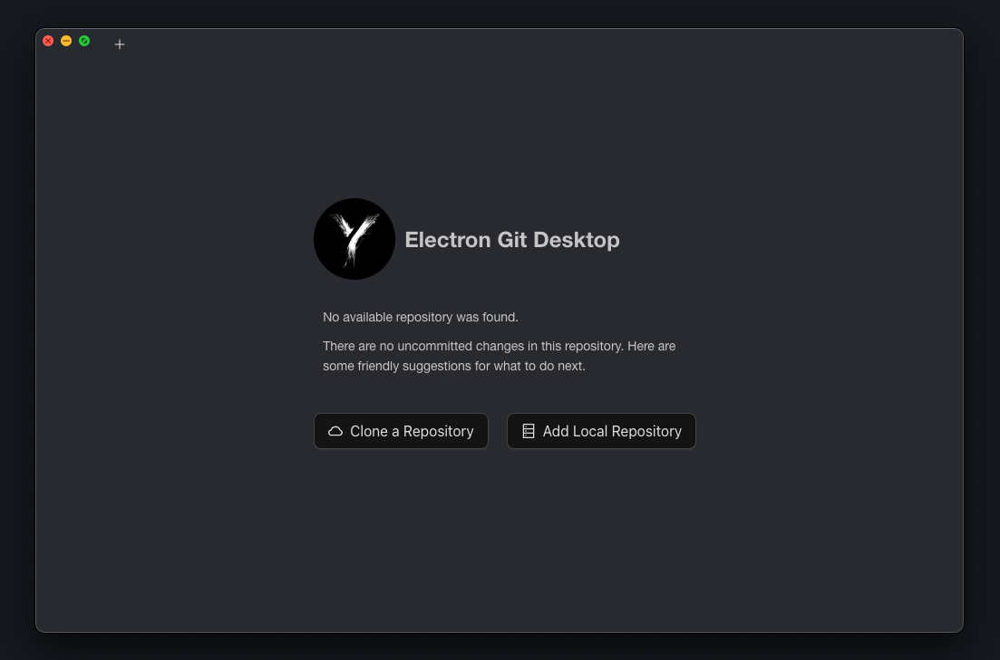
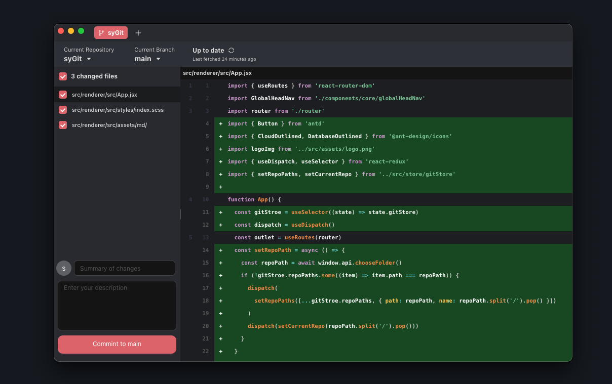
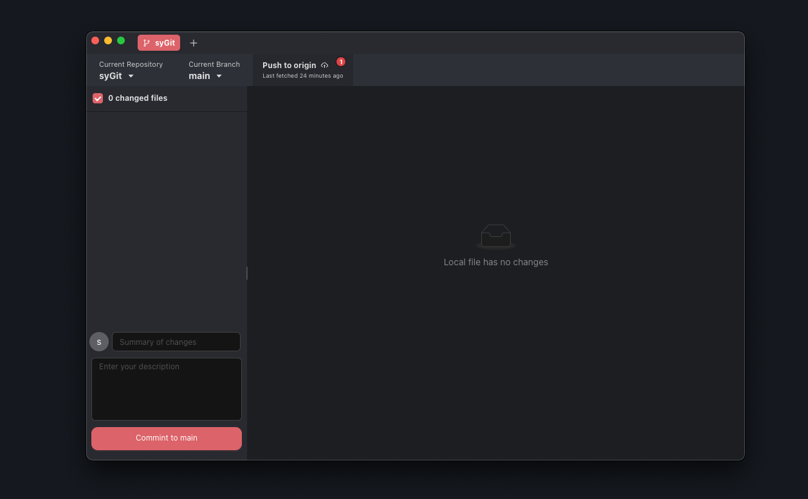

<div align="right">
  <a href="ReadMe.md">English</a> | <a href="ReadMe.cn.md">中文</a>
</div>

# Electron + React Git Desktop Tool

A Git desktop tool built with Electron + React. Tech Stack: **Electron + React + antd + Sass + localforage ...**

<div >
    
   
   
</div>
<br/>

## Project Screenshots
<div style="display:flex;align-items:center;justify-content:center;height:100%;">
    
    
    
</div>

<br/>

`Blog homepage`：<a>https://www.shmilyyy.cn</a>

`CSDN homepage`：<a>https://blog.csdn.net/shmilynn_?spm=1001.2014.3001.5343</a>

`GitHub homepage`：<a>https://github.com/IsMShmily</a>

## Project Structure

```
├─ resources
│  └─ icon.png
│  └─ src
│     ├─ main                       # Main Process
│     │  ├─ index.js
│     │  └─ ipc                     # Renderer Process
│     │     ├─ chooseFile.js
│     │     ├─ git.js               # Git Operations
│     │     └─ index.js
│     ├─ preload
│     │  └─ index.js                # Preload Layer
│     └─ renderer                   # Renderer Layer
│        ├─ index.html
│        └─ src
│           ├─ App.jsx
│           ├─ assets
│           ├─ components
│           ├─ localStore           # Data Storage
│           │  ├─ gitStore.js
│           │  └─ index.js
│           ├─ main.jsx
│           ├─ store
│           │  ├─ IsQueryOrder
│           │  │  └─ index.jsx
│           │  ├─ gitStore
│           │  │  └─ index.jsx
│           │  └─ index.jsx
│           ├─ styles
│           │  ├─ index.scss
│           │  ├─ reset.scss
│           │  └─ variable.scss
│           └─ views
│              ├─ 404
│              │  ├─ index.jsx
│              │  └─ index.scss
│              └─ home
│                 ├─ components
│                 ├─ index.jsx
│                 └─ index.module.scss
├─ .editorconfig
├─ .eslintignore
├─ .eslintrc.cjs
├─ .npmrc
├─ .prettierignore
├─ .prettierrc.yaml
├─ LICENSE
├─ README.md
├─ build
├─ dev-app-update.yml
├─ electron-builder.yml
├─ electron.vite.config.mjs
├─ package.json
├─ pnpm-lock.yaml
```

### Getting Started

By default, your computer should have Node.js, Vue, MongoDB, and a code editor installed. Please refer to my environment configuration:

```
Node.js: v18.18.0
react 18.3.1
antd：5.21.3
electron：31.0.2
```

```
git clone https://github.com/IsMShmily/Vue3_Ts_blog.git
```

## Installation and Running

| Command        | Description              |
| -------------- | ------------------------ |
| pnpm i         | Install dependencies     |
| pnpm run dev   | Start development server |
| pnpm run build | Build for production     |

## License

[MIT](LICENSE)
