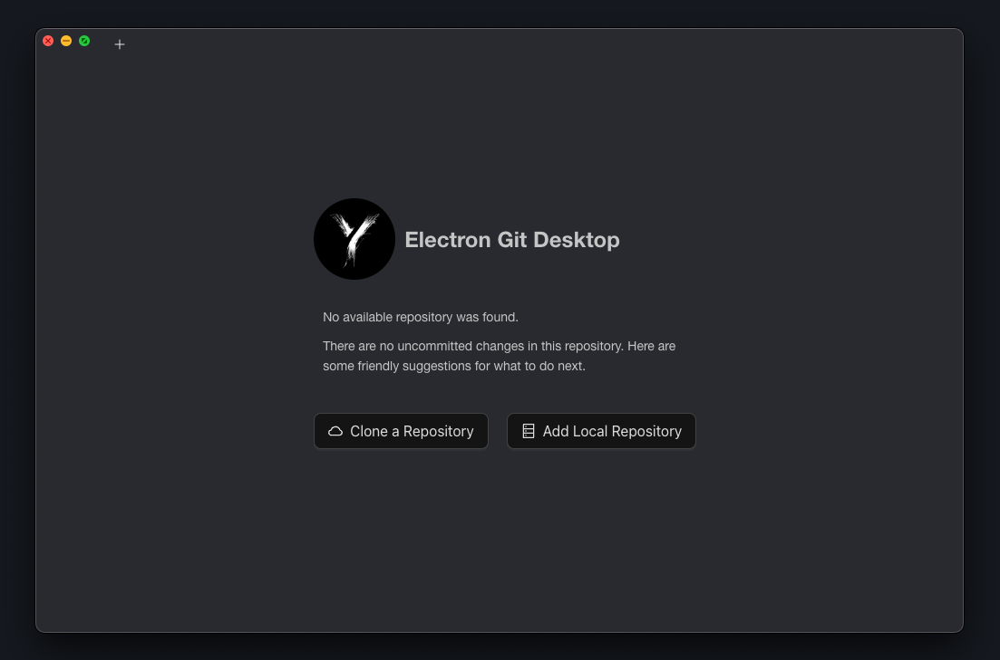
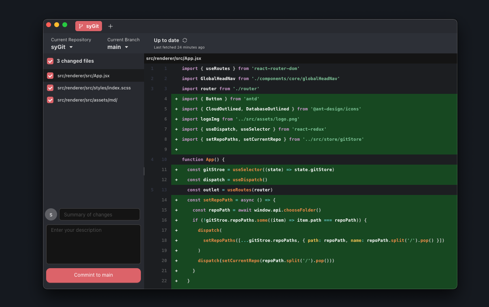
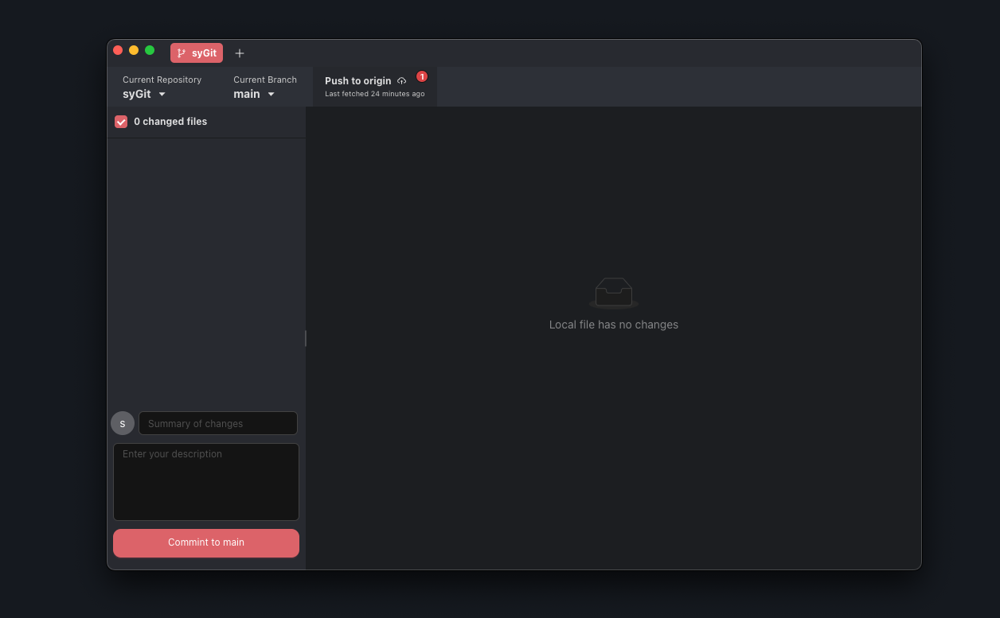

<div align="right">
  <a href="ReadMe.md">English</a> | <a href="ReadMe.cn.md">中文</a>
</div>

# Electron + React Git 桌面端工具

使用 Electron + React 构建的 Git 桌面端工具。技术栈：**Electron + React + antd + Sass + localforage ...**

<div >
    
   
   
</div>
<br/>

## 项目截图
<div style="display:flex;align-items:center;justify-content:center;height:100%;">
    
    
    
</div>

<br/>

`博客主页`：<a>https://www.shmilyyy.cn</a>

`CSDN主页`：<a>https://blog.csdn.net/shmilynn_?spm=1001.2014.3001.5343</a>

`GitHub主页`：<a>https://github.com/IsMShmily</a>

## 项目结构

```
├─ resources
│  └─ icon.png
│  └─ src
│     ├─ main                       # 主进程
│     │  ├─ index.js
│     │  └─ ipc                     # 渲染进程
│     │     ├─ chooseFile.js
│     │     ├─ git.js               # Git相关操作
│     │     └─ index.js
│     ├─ preload
│     │  └─ index.js                # preload层
│     └─ renderer                   # 渲染层
│        ├─ index.html
│        └─ src
│           ├─ App.jsx
│           ├─ assets
│           ├─ components
│           ├─ localStore           # 数据存储
│           │  ├─ gitStore.js
│           │  └─ index.js
│           ├─ main.jsx
│           ├─ store
│           │  ├─ IsQueryOrder
│           │  │  └─ index.jsx
│           │  ├─ gitStore
│           │  │  └─ index.jsx
│           │  └─ index.jsx
│           ├─ styles
│           │  ├─ index.scss
│           │  ├─ reset.scss
│           │  └─ variable.scss
│           └─ views
│              ├─ 404
│              │  ├─ index.jsx
│              │  └─ index.scss
│              └─ home
│                 ├─ components
│                 ├─ index.jsx
│                 └─ index.module.scss
├─ .editorconfig
├─ .eslintignore
├─ .eslintrc.cjs
├─ .npmrc
├─ .prettierignore
├─ .prettierrc.yaml
├─ LICENSE
├─ README.md
├─ build
├─ dev-app-update.yml
├─ electron-builder.yml
├─ electron.vite.config.mjs
├─ package.json
├─ pnpm-lock.yaml
```

### 开始使用

默认情况下，您的电脑应该已安装 Node.js、Vue、MongoDB 和代码编辑器。请参考我的环境配置：

```
Node.js: v18.18.0
react 18.3.1
antd：5.21.3
electron：31.0.2
```

```
git clone https://github.com/IsMShmily/Vue3_Ts_blog.git
```

## 安装与运行

| 命令           | 描述                   |
| -------------- | ---------------------- |
| pnpm i         | 安装依赖               |
| pnpm run dev   | 启动开发服务器         |
| pnpm run build | 构建生产环境版本       |

## 许可证

[MIT](LICENSE)
